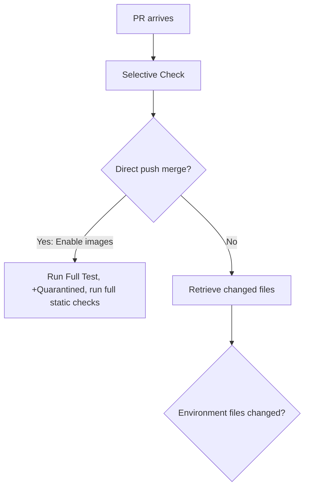

# golang-training
Notes about Udemy course to learn Golang: https://www.udemy.com/course/go-the-complete-developers-guide/

## Selective Checks Mermaid

E-->F{Environment files changed?}
F-->|No| G{Docs changed}
F-->|Yes| -->D
G-->|No|
G-->|Yes|