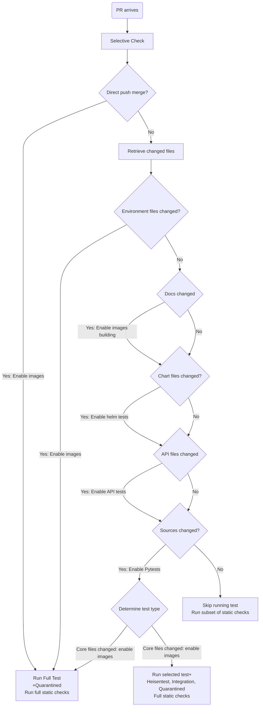
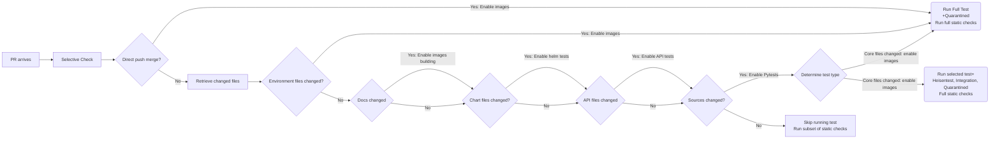

## Selective Checks Mermaid

## Vertical

```mermaid
flowchart TD
A(PR arrives)-->B[Selective Check]
B-->C{Direct push merge?}
C-->|Yes: Enable images| D[Run Full Test<br />+Quarantined<br />Run full static checks]
C-->|No| E[Retrieve changed files]
E-->F{Environment files changed?}
F-->|Yes: Enable images| D
F-->|No| G{Docs changed}
G-->|Yes: Enable images building| I{Chart files changed?}
G-->|No| I
I-->|Yes: Enable helm tests| J{API files changed}
I-->|No| J
J-->|Yes: Enable API tests| H{Sources changed?}
J-->|No| H
H-->|Yes: Enable Pytests| K{Determine test type}
K-->|Core files changed: enable images| D
K-->|Core files changed: enable images| M[Run selected test+<br />Heisentest, Integration, Quarantined<br />Full static checks] 
H-->|No| L[Skip running test<br />Run subset of static checks]
```

## Horisontal

```mermaid
flowchart LR
A[PR arrives]-->B[Selective Check]
B-->C{Direct push merge?}
C-->|Yes: Enable images| D(Run Full Test<br />+Quarantined<br />Run full static checks)
C-->|No| E[Retrieve changed files]
E-->F{Environment files changed?}
F-->|Yes: Enable images| D
F-->|No| G{Docs changed}
G-->|Yes: Enable images building| I{Chart files changed?}
G-->|No| I
I-->|Yes: Enable helm tests| J{API files changed}
I-->|No| J
J-->|Yes: Enable API tests| H{Sources changed?}
J-->|No| H
H-->|Yes: Enable Pytests| K{Determine test type}
K-->|Core files changed: enable images| D
K-->|Core files changed: enable images| M(Run selected test+<br />Heisentest, Integration, Quarantined<br />Full static checks)
H-->|No| L[Skip running test<br />Run subset of static checks]
```

