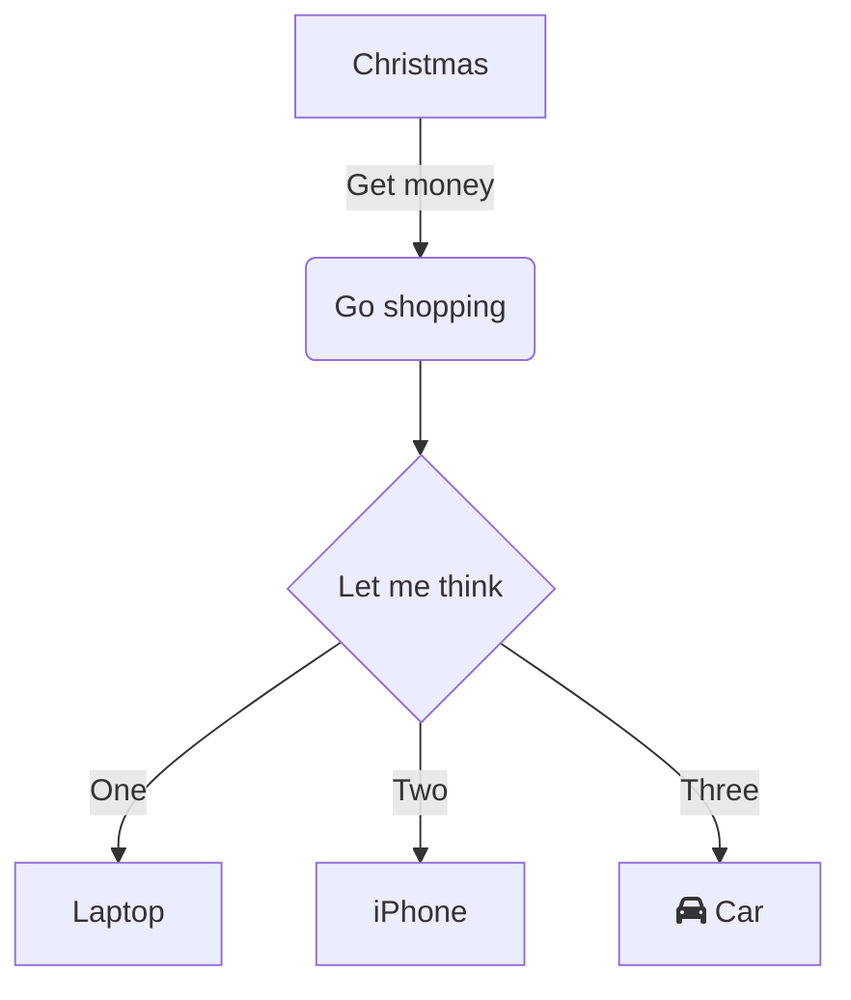
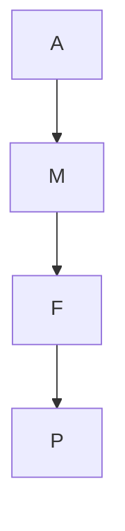

# golang-training
Notes about Udemy course to learn Golang: https://www.udemy.com/course/go-the-complete-developers-guide/

## How to deploy

```mermaid
graph TD
    A[Christmas] -->|Get money| B(Go shopping)
    B --> C{Let me think}
    C -->|One| D[Laptop]
    C -->|Two| E[iPhone]
    C -->|Three| F[fa:fa-car Car]
```

```mermaid
graph TD;
    A-->M
    M-->F
    F-->P
```